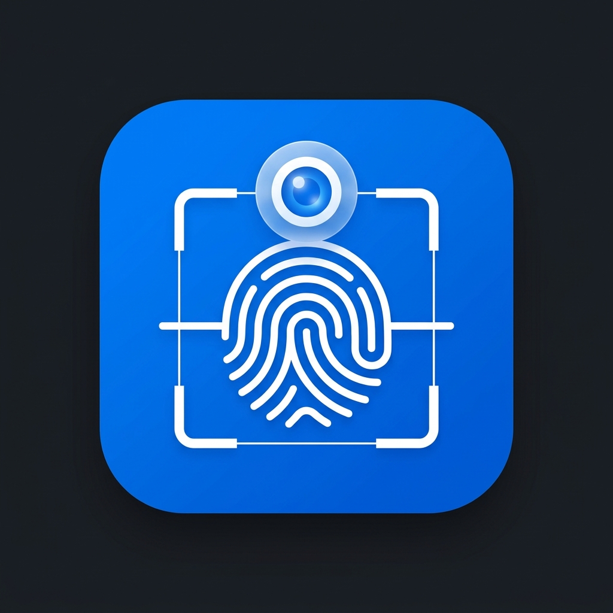

# AbsensiRB 📱📸

AbsensiRB adalah sistem presensi modern berbasis web yang dirancang khusus untuk mempermudah pelacakan kehadiran karyawan secara aman dan akurat. Dibangun dengan framework Laravel 11, sistem ini mengandalkan dua pilar utama keamanan: **Geofencing (GPS)** dan **Verifikasi Biometrik Wajah (Local AI)**.



## Fitur Utama ✨

- 📍 **Geofencing**: Membatasi area presensi berdasarkan titik koordinat (Latitude & Longitude) kantor pusat, diukur dalam satuan meter (Euclidean/Haversine distance).
- 🧑‍💻 **Face Recognition**: Menggunakan model *face-api.js* (Tiny Face Detector, Landmark68, FaceRecognitionNet) yang berjalan sepenuhnya di sisi klien (*client-side*). Algoritma ini menjamin server tidak terbebani secara komputasi sehingga cocok digunakan pada *Shared Hosting*.
- 🛡️ **Liveness Detection**: Menginstruksikan pengguna untuk berkedip atau tersenyum guna menghindari pemalsuan absen menggunakan foto statis.
- 🎨 **Minimalist UI**: Tampilan antarmuka yang bersih (biru dan putih), sepenuhnya responsif, didukung dengan *Phosphor Icons* (tanpa emoji *native* browser).
- 📸 **Admin Live Test**: Administrator memiliki menu khusus untuk memverifikasi kecocokan wajah secara *real-time* tanpa membuat catatan presensi yang sesungguhnya.

## Teknologi yang Digunakan 💻

- **Backend**: PHP 8.2+, Laravel 11.x
- **Database**: MySQL / MariaDB
- **Frontend**: Blade Templating, Alpine.js (untuk reaktivitas ringan)
- **Styling**: Vanilla CSS (CSS Variables untuk konsistensi tema) & Phosphor Icons.
- **AI/ML**: `face-api.js` (dijalankan via TensorFlow.js di browser pengguna)
- **Media**: Pengecilan (*resizing*) dan kompresi kanvas menggunakan HTML5 Canvas API sebelum pengiriman ke server.

## Struktur Database Inti 🗄️

- `users` & `roles` (Spatie Permission): Manajemen otentikasi.
- `face_references`: Menyimpan 128-dimensi *Face Descriptor* array JSON dan jalur absolut ke foto karyawan.
- `attendances`: Mencatat waktu absen, tipe (*check-in/check-out*), status kecocokan wajah, status lokasi GPS, dan jarak (meter).
- `attendance_failure_logs`: Mencatat aktivitas mencurigakan atau upaya absen di luar radius/wajah tidak dikenali.
- `system_settings`: Parameter global (Latitude Kantor, Longitude Kantor, Radius).

## Panduan Instalasi (Local Development) 🛠️

1. **Kloning Repositori:**
   ```bash
   git clone <repository_url> absensirb
   cd absensirb
   ```

2. **Instalasi Dependensi:**
   ```bash
   composer install
   npm install
   ```

3. **Konfigurasi Lingkungan:**
   ```bash
   cp .env.example .env
   php artisan key:generate
   ```
   Atur kredensial database di `.env` (`DB_DATABASE`, `DB_USERNAME`, `DB_PASSWORD`).

4. **Jalankan Migrasi Database:**
   ```bash
   php artisan migrate --seed
   ```
   *Catatan: Anda mungkin telah membuat seeder khusus untuk membuat akun Superadmin default.*

5. **Symlink Storage:**
   Pastikan folder penyimpanan dapat diakses oleh *public*:
   ```bash
   php artisan storage:link
   ```

6. **Jalankan Server Lokal:**
   ```bash
   php artisan serve
   ```
   Akses di `http://127.0.0.1:8000`.

## Catatan Khusus untuk Model AI (face-api.js) 🤖

Model-model AI (seperti `ssd_mobilenetv1_model-weights_manifest.json`, dll) berukuran cukup besar (beberapa Megabyte) dan diletakkan di dalam folder `/public/models`. 

**Sangat Penting:** Ketika memindahkan/men-deploy ke *Shared Hosting*, pastikan seluruh isi folder `/public/models` ikut terbawa agar deteksi wajah dapat berjalan.

---
*Dibuat oleh Tim IT AbsensiRB - Menggunakan teknologi web standar tanpa harus bergantung pada API pihak ketiga.*
# presensiRBNew
